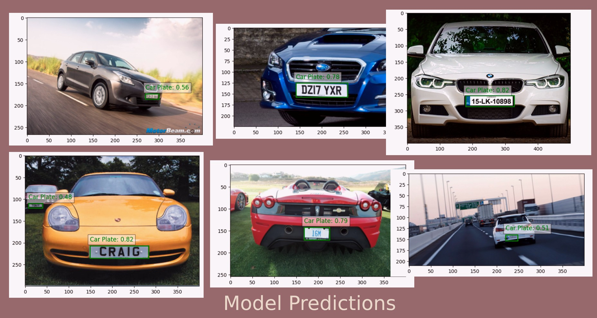

# Car Plate Detection using YOLOv8 🚀

Welcome to the car plate detection project using YOLOv8! This repository provides a step-by-step guide to preparing data, training an object detection model with YOLOv8, and running inference with the trained model.

## Overview

The basic usage is based on the YOLOv8 tutorial, customized for the current dataset to guide you through preparing data and training a model. This tutorial will cover everything from installation to training the YOLOv8 object detection model with a custom dataset and then exporting it for inference.

## Installation

This package is tested on Ubuntu 20.04 with Python 3.9.12. First, create your virtual environment:

```shell
python -m venv venv
source venv/bin/activate
```
Next, install all dependencies:

```shell
pip install -r requirements.txt
```

## Data Preparation
To use YOLOv8 for your object detection task, structure your data as follows:

1. In the root directory of your dataset, create two folders named images and labels. For this tutorial, we consider data/ in the root of our project as the dataset root.
2. Images can be in jpg or png formats.
3. Create a config file in yaml format specifying the paths to the root and images directories.
4. Separating train, validation, and test partitions is optional. If you do this, create subdirectories within both images and labels folders. Specify these paths in the config file.
5. Labels must be in txt format. For each bounding box in an image, include a row in the corresponding label file with the following structure (no commas): class_label bbx_x_center bbx_y_center bbx_width bbx_height.

The data directory should be structured like this:

```
data
├── images
│   ├── test
│   │   ├── Cars27.png
│   │   ├── ...
│   ├── train
│   │   ├── Cars0.png
│   │   ├── ...
│   └── validation
│       ├── Cars10.png
│       ├── ...
└── labels
    ├── test
    │   ├── Cars27.txt
    │   ├── ...
    ├── train
    │   ├── Cars0.txt
    │   ├── ...
    └── validation
        ├── Cars10.txt
        ├── ...
```

## Train YOLOv8 Object Detection Model on a Custom Dataset
To train your own object detection model, you can run:

```shell
python main.py
```

You can customize the following arguments:

* -rpr or --remove_prev_runs: Whether you want to remove previous runs.
* -p or --prepare: Whether you want to implement data preparation.
* -t or --train: Whether you want to implement training.
* -e or --export: Whether you want to export a saved model.

## Inference with Trained Models
To get predictions from a YOLO saved model, run:

```shell
python inference.py --model_path 'path/to/model' --image_path 'path/to/test_image'
```
The default path for the saved model is `runs/detect/train/weights/best.pt`. The test image can be in `jpg` or `png` format. The result of the model's predicted bounding boxes will be saved in the `runs` directory as a `png` file.